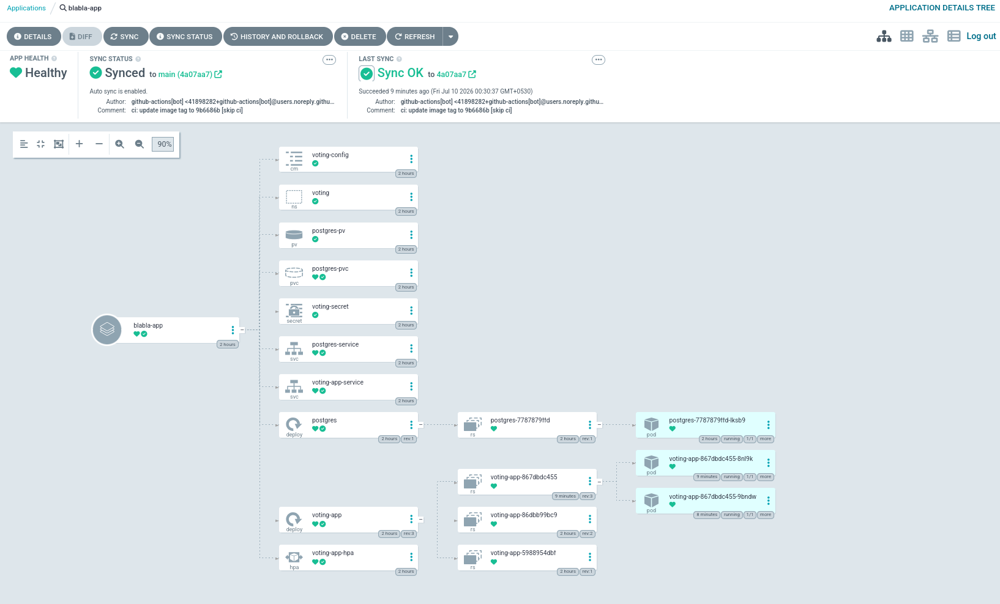
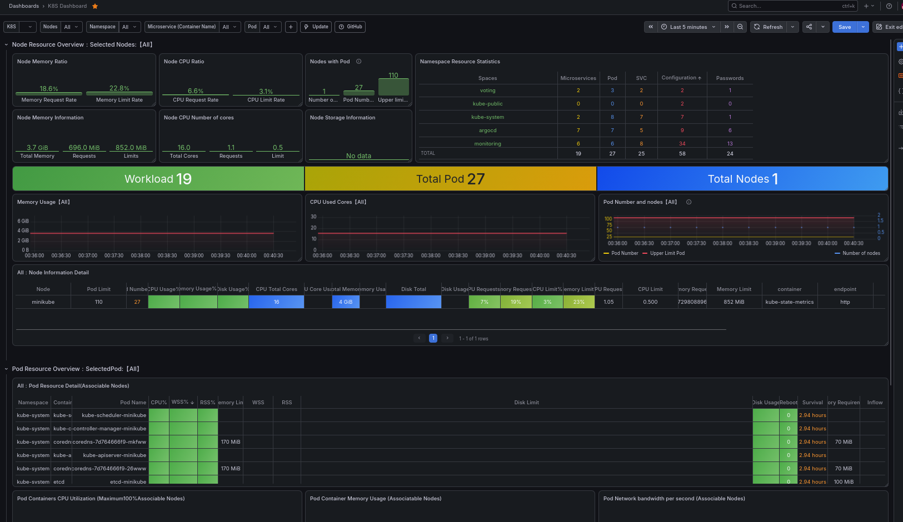

# VoteOps — GitOps Voting Application

A two-tier Flask voting application deployed on Kubernetes (Minikube) using **ArgoCD** for GitOps-driven continuous delivery, with **Prometheus & Grafana** for monitoring.




---

## Architecture

```
User → Browser → NodePort:30080 → voting-app-service → voting-app (Flask + Gunicorn)
                                                          ↕ (DB_HOST/DB_PORT via ConfigMap, credentials via Secret)
                                                        postgres:15-alpine ← PV/PVC (hostPath: /mnt/data/postgres)
```

- **voting-app**: Python/Flask container serving a Jinja2 voting UI + REST API
- **postgres**: PostgreSQL 15 Alpine backend persisting votes
- **HPA**: Auto-scales the app from 2–6 replicas based on CPU (60%) / memory (75%)

## Tech Stack

| Layer | Technology |
|---|---|
| **App** | Python 3.11, Flask, Gunicorn, Jinja2, psycopg2 |
| **Database** | PostgreSQL 15 Alpine |
| **Container** | Docker, slim Python base image |
| **Orchestration** | Kubernetes (Minikube) |
| **GitOps** | ArgoCD |
| **CI/CD** | GitHub Actions |
| **Monitoring** | Prometheus + Grafana |
| **Auto-scaling** | HorizontalPodAutoscaler (CPU 60%, Memory 75%) |

## Project Structure

```
.
├── .github/workflows/
│   └── deploy.yml              # CI pipeline: build → push → update manifest
├── docs/
│   ├── argocd.png              # ArgoCD application dashboard screenshot
│   └── grafana.png             # Grafana monitoring dashboard screenshot
├── voting-app/
│   ├── app/                    # Application source
│   │   ├── app.py              # Flask app (3 endpoints: /, /vote, /results, /health)
│   │   ├── Dockerfile          # gunicorn-based slim image
│   │   ├── requirements.txt    # Flask, Flask-CORS, psycopg2-binary, gunicorn
│   │   └── templates/
│   │       └── index.html      # Jinja2 UI with live polling
│   ├── k8s/                    # Kubernetes manifests (ArgoCD syncs this directory)
│   │   ├── namespace.yaml      # voting namespace
│   │   ├── deployment.yaml     # app Deployment + NodePort Service
│   │   ├── postgres.yaml       # postgres Deployment + ClusterIP Service
│   │   ├── configmap.yaml      # DB_HOST, DB_PORT
│   │   ├── secret.yaml         # DB_USER, DB_PASSWORD, DB_NAME (base64)
│   │   ├── pv.yaml             # PersistentVolume (hostPath 2Gi)
│   │   ├── pvc.yaml            # PersistentVolumeClaim (2Gi)
│   │   └── hpa.yaml            # HorizontalPodAutoscaler (2–6 replicas)
│   ├── .gitignore
│   └── SETUP.md                # Full setup guide (EC2, Minikube, ArgoCD, monitoring)
└── README.md                   # This file
```

## Prerequisites

- Minikube (`minikube start --cpus 2 --memory 4096`)
- kubectl
- Docker
- Helm (for installing ArgoCD)
- metrics-server addon (`minikube addons enable metrics-server`)
- Docker Hub account + Access Token

## Quick Start

### 1. Create PV directory on Minikube node

```bash
minikube ssh "sudo mkdir -p /mnt/data/postgres"
```

### 2. Install ArgoCD

```bash
kubectl create namespace argocd
kubectl apply -n argocd -f https://raw.githubusercontent.com/argoproj/argo-cd/stable/manifests/install.yaml
```

### 3. Create the ArgoCD Application

```bash
kubectl apply -f - <<EOF
apiVersion: argoproj.io/v1alpha1
kind: Application
metadata:
  name: voting-app
  namespace: argocd
spec:
  project: default
  source:
    repoURL: https://github.com/magarmach-hash/voteops.git
    targetRevision: main
    path: voting-app/k8s
  destination:
    server: https://kubernetes.default.svc
    namespace: voting
  syncPolicy:
    automated:
      prune: true
      selfHeal: true
    syncOptions:
      - CreateNamespace=true
EOF
```

### 4. Access the Application

```bash
kubectl port-forward -n voting svc/voting-app-service 5000:80
```

Open **http://localhost:5000**

### 5. Access ArgoCD

```bash
kubectl port-forward -n argocd svc/argocd-server 8080:80
```

Open **http://localhost:8080** — Username: `admin`, Password:

```bash
kubectl -n argocd get secret argocd-initial-admin-secret -o jsonpath="{.data.password}" | base64 -d
```

## CI/CD Pipeline (GitHub Actions)

On every push to `main`:

1. **detect-changes** — Checks if files under `voting-app/app/` were modified
2. **build-and-push** — Builds Docker image & pushes to Docker Hub with SHA tag + `latest`
3. **update-manifest** — Updates `voting-app/k8s/deployment.yaml` with the new image tag and commits back

### Required Secrets

| Secret | Value |
|---|---|
| `DOCKERHUB_USERNAME` | Your Docker Hub username |
| `DOCKERHUB_TOKEN` | Docker Hub PAT (Read & Write) |
| `GH_PAT` | GitHub PAT (repo scope) |

## API Endpoints

| Method | Path | Description |
|---|---|---|
| GET | `/` | Renders voting UI |
| POST | `/vote` | Submit a vote `{"option": "..."}` |
| GET | `/results` | JSON with vote counts |
| GET | `/health` | Health check |

## Monitoring (Prometheus + Grafana)

Install the kube-prometheus-stack via Helm:

```bash
helm repo add prometheus-community https://prometheus-community.github.io/helm-charts
helm repo update
helm install prometheus prometheus-community/kube-prometheus-stack -n monitoring --create-namespace
```

Access Grafana:

```bash
kubectl port-forward -n monitoring svc/prometheus-grafana 3000:80
```

Login: `admin` / `prom-operator`

Recommended dashboard IDs: **315**, **6417**, **1860**
